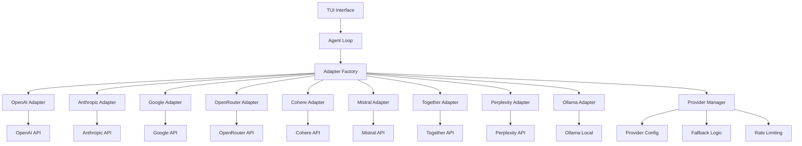
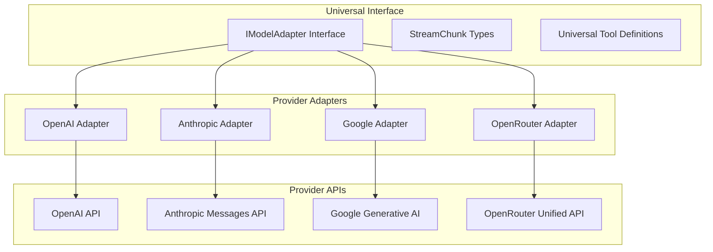

# Design Document: Multi-Provider AI Support

## Overview

This design extends theo-code's model adapter architecture to support multiple AI providers including Anthropic Claude, Google Gemini, OpenRouter, and additional providers. The implementation maintains the existing Universal Model Adapter Layer (UMAL) interface while adding provider-specific adapters, configuration management, and resilience features.

## Architecture

### High-Level Architecture



### Provider Adapter Architecture



## Components and Interfaces

### 1. Provider Manager (`src/features/model/provider-manager.ts`)

**Purpose**: Orchestrates provider selection, fallback logic, and configuration management.

**Key Methods**:
- `getAdapter(config: ModelConfig): IModelAdapter` - Get adapter for configuration
- `validateProvider(provider: string): Promise<boolean>` - Test provider connectivity
- `getAvailableProviders(): ProviderInfo[]` - List configured providers
- `setFallbackChain(providers: string[]): void` - Configure fallback sequence

**Responsibilities**:
- Provider registration and discovery
- Fallback provider management
- Rate limiting coordination
- Health monitoring

### 2. Anthropic Adapter (`src/features/model/adapters/anthropic.ts`)

**API Integration**: Anthropic Messages API
**Supported Models**: 
- claude-3-5-sonnet-20241022
- claude-3-opus-20240229
- claude-3-haiku-20240307

**Key Features**:
- Native tool calling support
- Streaming with Server-Sent Events
- Token counting via API
- System message handling

**Message Format Conversion**:
```typescript
// Universal → Anthropic
{
  role: 'user',
  content: 'Hello'
} → {
  role: 'user',
  content: [{ type: 'text', text: 'Hello' }]
}
```

### 3. Google Gemini Adapter (`src/features/model/adapters/google.ts`)

**API Integration**: Google Generative AI SDK
**Supported Models**:
- gemini-3-pro-preview (1M context, advanced reasoning, Jan 2025 knowledge)
- gemini-3-flash-preview (1M context, Pro-level intelligence at Flash speed)
- gemini-3-pro-image-preview (Image generation with reasoning)
- gemini-2-flash-preview (Multimodal agents, native tool use)
- gemini-2-flash-thinking-preview (Enhanced reasoning with thinking mode)
- gemini-1.5-pro (Legacy support)
- gemini-1.5-flash (Legacy support)

**Key Features**:
- **Advanced Reasoning**: Thinking levels (low, medium, high) for controlled reasoning depth
- **Multimodal Excellence**: Native image, video, audio processing with resolution controls
- **Thought Signatures**: Encrypted reasoning context for conversation continuity
- **Native Image Generation**: Built-in image creation and editing capabilities
- **Function calling support** with structured outputs
- **Streaming** with generateContentStream
- **Token counting** via countTokens API
- **Safety settings** configuration
- **Grounding** with Google Search and URL context

**Advanced Gemini 3.0 Features**:
```typescript
interface Gemini3Config {
  thinkingLevel?: 'low' | 'medium' | 'high';
  mediaResolution?: 'low' | 'medium' | 'high' | 'ultra_high';
  thoughtSignatures?: boolean; // For reasoning continuity
  imageGeneration?: {
    aspectRatio?: string;
    imageSize?: '1K' | '2K' | '4K';
  };
}
```

**Tool Format Conversion**:
```typescript
// Universal → Google
{
  name: 'readFile',
  parameters: { type: 'object', properties: {...} }
} → {
  name: 'readFile',
  description: '...',
  parameters: { type: 'OBJECT', properties: {...} }
}
```

**Thought Signature Handling**:
```typescript
// Maintain reasoning context across API calls
interface ThoughtSignature {
  signature: string; // Encrypted reasoning state
  turnId: string;    // Conversation turn identifier
}
```

### 4. OpenRouter Adapter (`src/features/model/adapters/openrouter.ts`)

**API Integration**: OpenRouter API (OpenAI-compatible)
**Supported Models**: All models in OpenRouter catalog

**Key Features**:
- Unified access to multiple providers
- OpenAI-compatible API format
- Model catalog discovery
- Usage tracking and credits

**Special Considerations**:
- Model-specific capabilities vary
- Rate limits per model
- Credit-based billing

### 5. Additional Provider Adapters

#### Cohere Adapter (`src/features/model/adapters/cohere.ts`)
- **Models**: command, command-light, command-nightly
- **Features**: Chat API, tool calling, streaming
- **Specialization**: Enterprise features, multilingual

#### Mistral Adapter (`src/features/model/adapters/mistral.ts`)
- **Models**: mistral-large, mistral-medium, mistral-small
- **Features**: Chat completions, function calling
- **Specialization**: European AI, efficiency

#### Together Adapter (`src/features/model/adapters/together.ts`)
- **Models**: Various open-source models
- **Features**: Inference API, custom models
- **Specialization**: Open-source model hosting

#### Perplexity Adapter (`src/features/model/adapters/perplexity.ts`)
- **Models**: pplx-7b-online, pplx-70b-online
- **Features**: Search-augmented generation
- **Specialization**: Real-time information access

#### Enhanced Ollama Adapter (`src/features/model/adapters/ollama.ts`)
- **Models**: Local models (llama2, codellama, mistral, etc.)
- **Features**: Local inference, model management
- **Specialization**: Privacy, offline usage

## Data Models

### Provider Configuration Schema

```typescript
interface ProviderConfig {
  name: string;
  apiKey?: string;
  baseUrl?: string;
  enabled: boolean;
  priority: number; // For fallback ordering
  rateLimit?: {
    requestsPerMinute: number;
    tokensPerMinute: number;
  };
  models: ModelInfo[];
}

interface ModelInfo {
  id: string;
  name: string;
  contextLimit: number;
  maxOutputTokens: number;
  supportsToolCalling: boolean;
  supportsStreaming: boolean;
  costPer1kTokens?: {
    input: number;
    output: number;
  };
}
```

### Enhanced Model Configuration

```typescript
interface EnhancedModelConfig extends ModelConfig {
  fallbackProviders?: string[];
  retryConfig?: {
    maxRetries: number;
    backoffMs: number;
    retryableErrors: string[];
  };
  features?: {
    toolCalling: boolean;
    streaming: boolean;
    multimodal: boolean;
    imageGeneration: boolean;
    reasoning: boolean;
  };
  // Gemini 3.0 specific configuration
  gemini?: {
    thinkingLevel?: 'low' | 'medium' | 'high';
    mediaResolution?: 'low' | 'medium' | 'high' | 'ultra_high';
    thoughtSignatures?: boolean;
    imageConfig?: {
      aspectRatio?: string;
      imageSize?: '1K' | '2K' | '4K';
    };
  };
  // Anthropic specific configuration
  anthropic?: {
    maxTokens?: number;
    systemMessage?: string;
  };
}
```

## Correctness Properties

*A property is a characteristic or behavior that should hold true across all valid executions of a system-essentially, a formal statement about what the system should do. Properties serve as the bridge between human-readable specifications and machine-verifiable correctness guarantees.*

### Property 1: Provider Interface Consistency
*For any* provider adapter, implementing the IModelAdapter interface should produce consistent StreamChunk outputs for equivalent inputs across all providers
**Validates: Requirements 1.2, 2.2, 3.2**

### Property 2: Tool Definition Conversion Accuracy
*For any* Universal Tool Definition, converting to provider-specific format and back should preserve all essential functionality
**Validates: Requirements 1.3, 2.3, 3.3**

### Property 3: Authentication Validation Completeness
*For any* provider configuration with valid credentials, the authentication validation should succeed consistently
**Validates: Requirements 1.1, 2.1, 3.1, 5.1**

### Property 4: Error Code Mapping Consistency
*For any* provider-specific error, the mapping to standard error codes should be deterministic and reversible
**Validates: Requirements 1.6, 2.6, 3.6, 7.1**

### Property 5: Token Counting Accuracy
*For any* message set, token counting should be consistent within a reasonable margin across multiple calls to the same provider
**Validates: Requirements 1.5, 2.5, 3.5**

### Property 6: Fallback Provider Selection
*For any* configured fallback chain, when the primary provider fails, the system should attempt providers in the specified order
**Validates: Requirements 5.3, 7.3**

### Property 7: Rate Limit Compliance
*For any* provider with rate limits, the system should never exceed the configured limits within the specified time window
**Validates: Requirements 7.2, 8.4**

### Property 8: Configuration Serialization Round-Trip
*For any* valid provider configuration, serializing then deserializing should preserve all functional properties
**Validates: Requirements 10.4**

### Property 9: Response Format Standardization
*For any* provider response, the conversion to StreamChunk format should preserve all essential information
**Validates: Requirements 9.1, 9.2**

### Property 10: Model Capability Detection Accuracy
*For any* model, the detected capabilities should match the actual API behavior for tool calling and streaming
**Validates: Requirements 6.1, 6.2, 6.4**

## Error Handling

### Error Categories

1. **Authentication Errors**
   - Invalid API keys
   - Expired credentials
   - Insufficient permissions

2. **Rate Limiting Errors**
   - Request rate exceeded
   - Token rate exceeded
   - Quota exhausted

3. **Request Errors**
   - Invalid model name
   - Context length exceeded
   - Malformed request

4. **Network Errors**
   - Connection timeout
   - DNS resolution failure
   - Service unavailable

5. **Provider-Specific Errors**
   - Content policy violations
   - Model overloaded
   - Maintenance mode

### Error Handling Strategy

```typescript
interface ErrorHandlingConfig {
  retryableErrors: Set<string>;
  maxRetries: number;
  backoffStrategy: 'exponential' | 'linear' | 'fixed';
  fallbackEnabled: boolean;
  timeoutMs: number;
}

class ProviderErrorHandler {
  async handleError(
    error: AdapterError,
    config: ErrorHandlingConfig,
    fallbackProviders: string[]
  ): Promise<IModelAdapter | null> {
    // 1. Check if error is retryable
    // 2. Apply backoff strategy
    // 3. Attempt fallback providers
    // 4. Return null if all options exhausted
  }
}
```

## Testing Strategy

### Unit Testing
- **Provider Adapter Tests**: Test each adapter's API integration
- **Message Conversion Tests**: Verify format conversions are accurate
- **Error Handling Tests**: Test error mapping and retry logic
- **Configuration Tests**: Validate configuration loading and validation

### Property-Based Testing
- **Cross-Provider Consistency**: Verify equivalent inputs produce equivalent outputs
- **Tool Definition Round-Trips**: Test tool format conversions preserve functionality
- **Token Counting Stability**: Verify token counts are consistent
- **Error Code Mapping**: Test error code mappings are bijective where possible

### Integration Testing
- **End-to-End Provider Tests**: Test complete workflows with real APIs
- **Fallback Chain Tests**: Verify fallback logic works correctly
- **Rate Limiting Tests**: Test rate limit compliance
- **Configuration Loading Tests**: Test configuration from various sources

### Performance Testing
- **Response Time Benchmarks**: Compare provider response times
- **Throughput Tests**: Test concurrent request handling
- **Memory Usage Tests**: Verify adapters don't leak memory
- **Token Counting Performance**: Benchmark token counting methods

### Test Configuration

**Property-Based Tests**:
- Minimum 100 iterations per property test
- Each test tagged with: **Feature: multi-provider-support, Property {number}: {property_text}**
- Use fast-check for input generation
- Mock external APIs for deterministic testing

**Integration Tests**:
- Use test API keys or mock servers
- Test against provider staging environments where available
- Implement circuit breakers for test stability
- Use Docker containers for Ollama testing