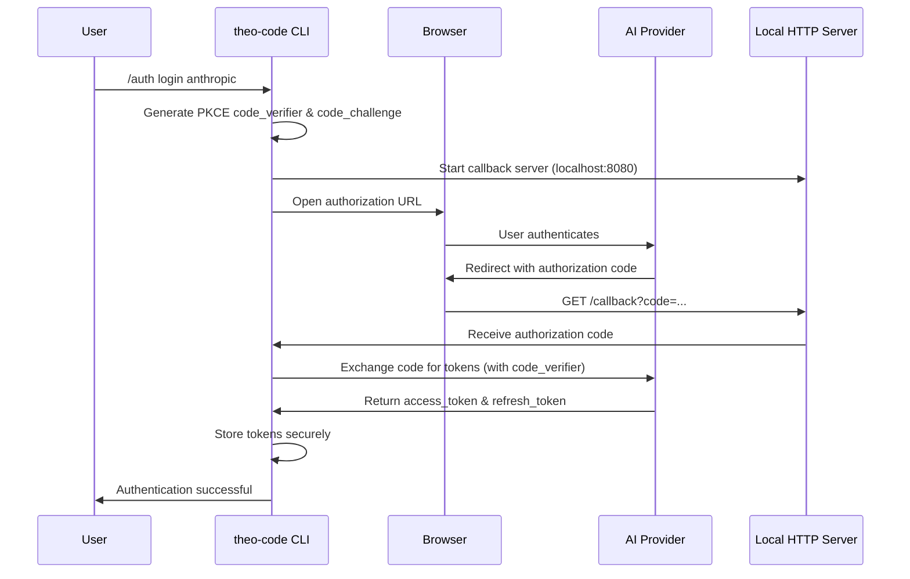
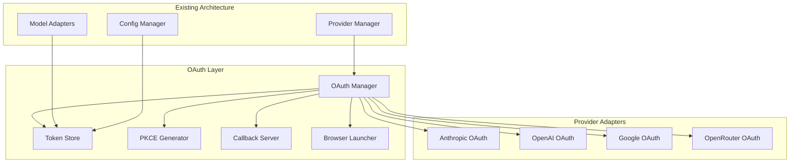

# Design Document: OAuth Authentication for AI Providers

## Overview

This design implements OAuth 2.0 authentication with PKCE (Proof Key for Code Exchange) for AI providers that support it, providing a secure and user-friendly alternative to API key authentication. The implementation will integrate with the existing multi-provider architecture while adding OAuth-specific components for token management, browser-based authentication flows, and secure credential storage.

## Architecture

### High-Level OAuth Flow Architecture



### OAuth Integration Architecture



## Components and Interfaces

### 1. OAuth Manager (`src/features/auth/oauth-manager.ts`)

**Purpose**: Orchestrates OAuth flows for all supported providers.

**Key Methods**:
- `initiateFlow(provider: string): Promise<OAuthResult>` - Start OAuth flow
- `handleCallback(code: string, state: string): Promise<TokenSet>` - Process callback
- `refreshTokens(provider: string): Promise<TokenSet>` - Refresh expired tokens
- `revokeTokens(provider: string): Promise<void>` - Revoke and clear tokens
- `getAuthStatus(provider: string): AuthStatus` - Check authentication status

**Key Properties**:
- Provider-specific OAuth configurations
- Active callback server management
- State parameter validation
- PKCE code management

### 2. Token Store (`src/features/auth/token-store.ts`)

**Purpose**: Secure storage and management of OAuth tokens.

**Key Methods**:
- `storeTokens(provider: string, tokens: TokenSet): Promise<void>` - Store tokens securely
- `getTokens(provider: string): Promise<TokenSet | null>` - Retrieve stored tokens
- `clearTokens(provider: string): Promise<void>` - Remove tokens
- `isTokenValid(provider: string): Promise<boolean>` - Check token validity
- `refreshIfNeeded(provider: string): Promise<TokenSet>` - Auto-refresh logic

**Security Features**:
- Encryption using system keychain (keytar library)
- Automatic token expiration handling
- Secure token validation
- Memory protection for sensitive data

### 3. PKCE Generator (`src/features/auth/pkce-generator.ts`)

**Purpose**: Generate and validate PKCE parameters for secure OAuth flows.

**Key Methods**:
- `generateCodeVerifier(): string` - Generate cryptographically secure code verifier
- `generateCodeChallenge(verifier: string): string` - Create SHA256 code challenge
- `validateCodeVerifier(verifier: string, challenge: string): boolean` - Validate PKCE pair

**Implementation**:
- Uses Node.js crypto module for secure random generation
- Implements SHA256 hashing for code challenges
- Base64URL encoding for web-safe parameters

### 4. Callback Server (`src/features/auth/callback-server.ts`)

**Purpose**: Temporary HTTP server to handle OAuth callbacks.

**Key Methods**:
- `start(port?: number): Promise<number>` - Start server on available port
- `stop(): Promise<void>` - Stop server and cleanup
- `waitForCallback(): Promise<CallbackResult>` - Wait for OAuth callback
- `handleTimeout(): void` - Handle authentication timeout

**Features**:
- Automatic port selection (8080, 8081, etc.)
- Timeout handling (5 minutes default)
- Success/error page rendering
- Graceful shutdown

### 5. Provider-Specific OAuth Adapters

#### Anthropic OAuth Adapter (`src/features/auth/providers/anthropic-oauth.ts`)

**OAuth Configuration**:
```typescript
const ANTHROPIC_OAUTH_CONFIG = {
  authorizationEndpoint: 'https://console.anthropic.com/oauth/authorize',
  tokenEndpoint: 'https://console.anthropic.com/oauth/token',
  scopes: ['api:read', 'api:write'],
  clientId: 'theo-code-cli', // To be registered with Anthropic
};
```

**Note**: Based on research, Anthropic may not currently support OAuth 2.0. This adapter will be implemented as a placeholder for future support, with fallback to API key authentication.

#### OpenAI OAuth Adapter (`src/features/auth/providers/openai-oauth.ts`)

**OAuth Configuration**:
```typescript
const OPENAI_OAUTH_CONFIG = {
  authorizationEndpoint: 'https://auth.openai.com/oauth/authorize',
  tokenEndpoint: 'https://auth.openai.com/oauth/token',
  scopes: ['api:read', 'api:write'],
  clientId: 'theo-code-cli', // To be registered with OpenAI
};
```

**Note**: Based on research, OpenAI may not currently support public OAuth 2.0. This adapter will be implemented as a placeholder for future support.

#### Google OAuth Adapter (`src/features/auth/providers/google-oauth.ts`)

**OAuth Configuration**:
```typescript
const GOOGLE_OAUTH_CONFIG = {
  authorizationEndpoint: 'https://accounts.google.com/o/oauth2/v2/auth',
  tokenEndpoint: 'https://oauth2.googleapis.com/token',
  scopes: [
    'https://www.googleapis.com/auth/generative-language.retriever',
    'https://www.googleapis.com/auth/cloud-platform'
  ],
  clientId: 'theo-code-cli.googleusercontent.com', // To be registered
};
```

**Implementation Notes**:
- Supports Google's OAuth 2.0 implementation
- Uses Application Default Credentials (ADC) pattern
- Handles Google-specific token refresh logic

#### OpenRouter OAuth Adapter (`src/features/auth/providers/openrouter-oauth.ts`)

**OAuth Configuration**:
```typescript
const OPENROUTER_OAUTH_CONFIG = {
  authorizationEndpoint: 'https://openrouter.ai/auth',
  tokenEndpoint: 'https://openrouter.ai/api/v1/auth/keys',
  scopes: ['api:read'],
  clientId: 'theo-code-cli', // To be registered with OpenRouter
};
```

**Implementation Notes**:
- Uses OpenRouter's PKCE-based OAuth flow
- Implements custom token exchange endpoint
- Handles OpenRouter-specific API key generation

## Data Models

### OAuth Configuration Schema

```typescript
interface OAuthConfig {
  provider: string;
  clientId: string;
  clientSecret?: string; // Optional for PKCE flows
  authorizationEndpoint: string;
  tokenEndpoint: string;
  scopes: string[];
  redirectUri: string;
  additionalParams?: Record<string, string>;
}

interface TokenSet {
  accessToken: string;
  refreshToken?: string;
  expiresAt: Date;
  tokenType: 'Bearer';
  scope?: string;
}

interface OAuthResult {
  success: boolean;
  tokens?: TokenSet;
  error?: string;
  provider: string;
}

interface AuthStatus {
  provider: string;
  authenticated: boolean;
  method: 'oauth' | 'api_key' | 'none';
  expiresAt?: Date;
  needsRefresh: boolean;
}
```

### Configuration Integration

The OAuth configuration will extend the existing provider configuration schema:

```typescript
interface ProviderConfig {
  // Existing fields...
  
  // OAuth-specific configuration
  oauth?: {
    enabled: boolean;
    clientId?: string;
    preferredMethod: 'oauth' | 'api_key';
    autoRefresh: boolean;
  };
}
```

## Correctness Properties

*A property is a characteristic or behavior that should hold true across all valid executions of a system-essentially, a formal statement about what the system should do. Properties serve as the bridge between human-readable specifications and machine-verifiable correctness guarantees.*

Based on the prework analysis, here are the key correctness properties for OAuth authentication:

### Property 1: PKCE Parameter Inclusion
*For any* OAuth authorization URL generation, the resulting URL should contain both code_challenge and code_challenge_method parameters with valid values
**Validates: Requirements 1.2**

### Property 2: Token Exchange Completeness
*For any* valid authorization code, the token exchange process should return properly formatted access and refresh tokens
**Validates: Requirements 1.4**

### Property 3: Secure Token Storage
*For any* OAuth token storage operation, the stored data should be encrypted and not readable as plain text
**Validates: Requirements 6.1**

### Property 4: Authentication Method Priority
*For any* provider with both OAuth and API key authentication configured, OAuth tokens should be used preferentially for API calls
**Validates: Requirements 2.4, 7.2**

### Property 5: Automatic Token Refresh
*For any* expired OAuth token with a valid refresh token, API calls should trigger automatic token refresh before proceeding
**Validates: Requirements 2.5, 6.2**

### Property 6: Authentication Fallback
*For any* OAuth authentication failure, the system should fallback to API key authentication when available
**Validates: Requirements 2.6, 7.3**

### Property 7: Token Security
*For any* system operation, OAuth tokens should never appear in logs, error messages, or other outputs in plain text
**Validates: Requirements 6.6**

### Property 8: Configuration Round-Trip
*For any* valid OAuth configuration, serializing then deserializing should preserve all functional properties
**Validates: Requirements 10.4**

### Property 9: Token Response Normalization
*For any* provider-specific token response, the normalized format should contain all required fields (access_token, expires_at, token_type)
**Validates: Requirements 11.2**

### Property 10: Secure Display Formatting
*For any* token information display, sensitive data (tokens, secrets) should be masked or excluded from the output
**Validates: Requirements 10.3, 11.3**

<function_calls>
<invoke name="prework">
<parameter name="featureName">oauth-authentication

## Error Handling

### OAuth Flow Errors

**Authorization Errors**:
- Invalid client ID or configuration
- User denies authorization
- Provider service unavailable
- Network connectivity issues

**Token Exchange Errors**:
- Invalid authorization code
- PKCE verification failure
- Expired authorization code
- Provider token endpoint errors

**Token Management Errors**:
- Token storage/retrieval failures
- Token refresh failures
- Token validation errors
- Keychain access denied

### Error Recovery Strategies

1. **Graceful Degradation**: Fall back to API key authentication when OAuth fails
2. **Retry Logic**: Implement exponential backoff for transient network errors
3. **User Guidance**: Provide clear error messages with suggested actions
4. **Resource Cleanup**: Ensure callback servers and temporary resources are cleaned up
5. **Security Measures**: Invalidate compromised tokens and require re-authentication

### Error Response Format

```typescript
interface OAuthError {
  code: string;
  message: string;
  provider: string;
  recoverable: boolean;
  suggestedAction?: string;
  fallbackAvailable: boolean;
}
```

## Testing Strategy

### Dual Testing Approach

The OAuth authentication system requires both **unit tests** and **property-based tests** for comprehensive coverage:

**Unit Tests** focus on:
- Specific OAuth flow scenarios (successful login, token refresh, logout)
- Error conditions and edge cases
- Integration points with existing provider adapters
- Command interface functionality
- Mock provider responses

**Property-Based Tests** focus on:
- Universal properties that hold across all providers and inputs
- PKCE parameter generation and validation
- Token security and encryption properties
- Configuration serialization round-trips
- Authentication method priority and fallback behavior

### Property-Based Testing Configuration

- **Testing Library**: Use `fast-check` for TypeScript property-based testing
- **Test Iterations**: Minimum 100 iterations per property test
- **Test Tagging**: Each property test must reference its design document property
- **Tag Format**: `**Feature: oauth-authentication, Property {number}: {property_text}**`

### Test Categories

**OAuth Flow Tests**:
- Mock provider OAuth endpoints for testing
- Test PKCE generation and validation
- Test callback server lifecycle
- Test browser launching (mocked)

**Token Management Tests**:
- Test secure token storage and retrieval
- Test automatic token refresh logic
- Test token expiration handling
- Test token revocation

**Integration Tests**:
- Test OAuth integration with existing provider adapters
- Test fallback to API key authentication
- Test configuration management
- Test command interface

**Security Tests**:
- Test token encryption in storage
- Test that tokens are never logged
- Test PKCE security properties
- Test secure configuration display

### Mock Strategy

**Provider Mocking**:
- Mock OAuth authorization endpoints
- Mock token exchange endpoints
- Mock token refresh endpoints
- Simulate various error conditions

**System Mocking**:
- Mock browser launching for automated tests
- Mock keychain/secure storage
- Mock network requests
- Mock callback server responses

### Test Data Generation

**Property Test Generators**:
- Generate valid OAuth configurations
- Generate PKCE code verifiers and challenges
- Generate token responses with various formats
- Generate error scenarios and edge cases

The testing strategy ensures that OAuth authentication is thoroughly validated while maintaining compatibility with the existing multi-provider architecture.