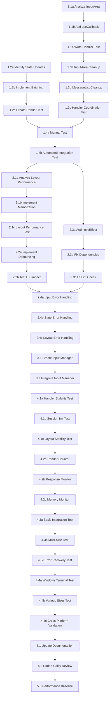

# Screen Flickering Fix - Implementation Tasks

## Overview

This task breakdown provides a structured approach to implementing the screen flickering fix. Tasks are organized by priority and dependency, ensuring critical fixes are implemented first while maintaining system stability.

## Task Categories

- **Critical**: Must be completed to resolve the flickering issue
- **Important**: Improves stability and prevents regression
- **Enhancement**: Adds monitoring and validation capabilities

## Tasks

### Phase 1: Critical Hook Fixes

- [ ] **Task 1.1a: Analyze InputArea useInput Current Implementation** (Critical)
  - **File**: `src/shared/components/Layout/InputArea.tsx`
  - **Description**: Examine current useInput implementation to identify dependency issues
  - **Acceptance Criteria**:
    - Document current useInput usage and dependencies
    - Identify all variables used within the handler
    - List all props and state accessed in the handler
    - Create plan for dependency array
  - **Estimated Time**: 10 minutes
  - **Dependencies**: None
  - **Validation**: Analysis document with current state

- [ ] **Task 1.1b: Add useCallback Wrapper to InputArea Handler** (Critical)
  - **File**: `src/shared/components/Layout/InputArea.tsx`
  - **Description**: Wrap useInput handler with useCallback and proper dependencies
  - **Acceptance Criteria**:
    - useInput handler has proper useCallback wrapper
    - Dependency array includes all variables used within handler
    - Handler function reference remains stable across renders
    - No stale closures are created during re-renders
  - **Estimated Time**: 15 minutes
  - **Dependencies**: Task 1.1a
  - **Validation**: Handler reference stability test

- [ ] **Task 1.1c: Write Unit Test for InputArea Handler Stability** (Critical)
  - **File**: `src/shared/components/Layout/InputArea.test.tsx`
  - **Description**: Create unit test to verify handler doesn't re-register unnecessarily
  - **Acceptance Criteria**:
    - Test verifies handler function reference stability
    - Test checks that handler only re-registers when dependencies change
    - Test validates no stale closures are created
  - **Estimated Time**: 15 minutes
  - **Dependencies**: Task 1.1b
  - **Validation**: Unit test passes consistently

- [ ] **Task 1.2a: Identify Session Initialization State Updates** (Critical)
  - **File**: `src/app.tsx`
  - **Description**: Catalog all state updates that occur during session initialization
  - **Acceptance Criteria**:
    - List all setState calls in initializeNewSession function
    - Document current render cycle count during initialization
    - Identify which updates can be batched together
    - Plan batching strategy
  - **Estimated Time**: 15 minutes
  - **Dependencies**: None
  - **Validation**: State update analysis document

- [ ] **Task 1.2b: Implement State Batching in initializeNewSession** (Critical)
  - **File**: `src/app.tsx`
  - **Description**: Combine multiple state updates into single batched operation
  - **Acceptance Criteria**:
    - All session initialization state updates are batched
    - State updates use functional updates for consistency
    - startTransition is used for non-urgent updates
  - **Estimated Time**: 20 minutes
  - **Dependencies**: Task 1.2a
  - **Validation**: Single render cycle during initialization

- [ ] **Task 1.2c: Create Render Cycle Test for Session Initialization** (Critical)
  - **File**: `src/test/session-initialization.test.tsx`
  - **Description**: Test that session creation triggers only one re-render
  - **Acceptance Criteria**:
    - Test measures render cycle count during session creation
    - Test verifies only one re-render occurs
    - Test validates session state is correctly set
  - **Estimated Time**: 20 minutes
  - **Dependencies**: Task 1.2b
  - **Validation**: Integration test measuring render cycles

- [ ] **Task 1.3a: Add Cleanup to InputArea useInput Handler** (Critical)
  - **File**: `src/shared/components/Layout/InputArea.tsx`
  - **Description**: Ensure InputArea properly cleans up its useInput handler
  - **Acceptance Criteria**:
    - useEffect cleanup function properly removes handler
    - No memory leaks from uncleaned handlers
    - Handler cleanup occurs on component unmount
  - **Estimated Time**: 10 minutes
  - **Dependencies**: Task 1.1c
  - **Validation**: Memory leak test

- [ ] **Task 1.3b: Add Cleanup to MessageList useInput Handler** (Critical)
  - **File**: `src/shared/components/Layout/MessageList.tsx`
  - **Description**: Ensure MessageList properly cleans up its useInput handler
  - **Acceptance Criteria**:
    - useEffect cleanup function properly removes handler
    - Handler registration/cleanup is properly coordinated
    - Only one input handler active at any time
  - **Estimated Time**: 10 minutes
  - **Dependencies**: Task 1.3a
  - **Validation**: Handler conflict test

- [ ] **Task 1.3c: Create Handler Coordination Test** (Critical)
  - **File**: `src/test/input-handler-coordination.test.tsx`
  - **Description**: Test that multiple input handlers don't conflict
  - **Acceptance Criteria**:
    - Test verifies only one handler is active at a time
    - Test checks proper cleanup when components unmount
    - Test validates no handler conflicts occur
  - **Estimated Time**: 15 minutes
  - **Dependencies**: Task 1.3b
  - **Validation**: Handler conflict prevention test

- [ ] **Task 1.4a: Manual Test "New Session" Without Flickering** (Critical)
  - **Description**: Manually verify session creation works without flickering
  - **Acceptance Criteria**:
    - "New Session" selection completes without visual flickering
    - User maintains control of input throughout process
    - No console errors during session creation
  - **Estimated Time**: 10 minutes
  - **Dependencies**: Tasks 1.1c, 1.2c, 1.3c
  - **Validation**: Manual testing checklist

- [ ] **Task 1.4b: Create Automated Integration Test for Session Creation** (Critical)
  - **File**: `src/test/new-session-integration.test.tsx`
  - **Description**: Automated test for complete session creation workflow
  - **Acceptance Criteria**:
    - Test simulates "New Session" selection
    - Test verifies session initialization completes within 100ms
    - Test checks no flickering occurs (render cycle count)
    - Test validates final session state
  - **Estimated Time**: 20 minutes
  - **Dependencies**: Task 1.4a
  - **Validation**: Automated integration test passes

### Phase 2: Layout and State Optimization

- [ ] **Task 2.1a: Analyze FullScreenLayout Performance** (Important)
  - **File**: `src/shared/components/Layout/FullScreenLayout.tsx`
  - **Description**: Profile current layout calculation performance and identify bottlenecks
  - **Acceptance Criteria**:
    - Document current layout calculation frequency
    - Identify expensive calculations that can be memoized
    - Measure performance impact of layout recalculations
    - Create optimization plan
  - **Estimated Time**: 10 minutes
  - **Dependencies**: Task 1.4b
  - **Validation**: Performance analysis report

- [ ] **Task 2.1b: Implement Layout Calculation Memoization** (Important)
  - **File**: `src/shared/components/Layout/FullScreenLayout.tsx`
  - **Description**: Use useMemo to prevent unnecessary layout recalculations
  - **Acceptance Criteria**:
    - Layout calculations are memoized with proper dependencies
    - No recalculation during session initialization
    - Layout remains stable during state transitions
  - **Estimated Time**: 15 minutes
  - **Dependencies**: Task 2.1a
  - **Validation**: Layout calculation frequency test

- [ ] **Task 2.1c: Create Performance Test for Layout Calculations** (Important)
  - **File**: `src/test/layout-performance.test.tsx`
  - **Description**: Test that layout calculations are optimized and don't recalculate unnecessarily
  - **Acceptance Criteria**:
    - Test measures layout calculation frequency
    - Test verifies memoization is working correctly
    - Performance improvement is measurable
  - **Estimated Time**: 15 minutes
  - **Dependencies**: Task 2.1b
  - **Validation**: Performance test measuring calculation frequency

- [ ] **Task 2.2a: Implement Dimension Change Debouncing** (Important)
  - **File**: `src/shared/components/Layout/FullScreenLayout.tsx`
  - **Description**: Add debouncing to prevent layout thrashing during rapid resizes
  - **Acceptance Criteria**:
    - Dimension changes are debounced with 100ms delay
    - Rapid resize events don't cause multiple re-renders
    - Layout remains stable during session creation
  - **Estimated Time**: 15 minutes
  - **Dependencies**: Task 2.1c
  - **Validation**: Rapid resize test

- [ ] **Task 2.2b: Test Debouncing Doesn't Affect User Experience** (Important)
  - **File**: `src/test/resize-debouncing.test.tsx`
  - **Description**: Verify debouncing works without negatively impacting UX
  - **Acceptance Criteria**:
    - Debouncing doesn't affect user experience
    - Layout updates are smooth and responsive
    - No visual glitches during resize
  - **Estimated Time**: 10 minutes
  - **Dependencies**: Task 2.2a
  - **Validation**: UX validation test

- [ ] **Task 2.3a: Audit useEffect Dependencies in Core Components** (Important)
  - **Files**: `src/shared/components/Layout/*.tsx`
  - **Description**: Systematically review useEffect hooks in layout components
  - **Acceptance Criteria**:
    - All useEffect hooks in layout components are audited
    - Missing dependencies are identified
    - Unnecessary dependencies are flagged
    - Create fix plan for each component
  - **Estimated Time**: 20 minutes
  - **Dependencies**: Task 1.4b
  - **Validation**: Dependency audit report

- [ ] **Task 2.3b: Fix useEffect Dependencies in Layout Components** (Important)
  - **Files**: Various layout components
  - **Description**: Apply fixes identified in the audit
  - **Acceptance Criteria**:
    - All useEffect hooks have correct dependency arrays
    - No missing dependencies that could cause stale closures
    - No unnecessary dependencies that cause excessive re-runs
  - **Estimated Time**: 15 minutes
  - **Dependencies**: Task 2.3a
  - **Validation**: ESLint exhaustive-deps rule passes

- [ ] **Task 2.3c: Run ESLint Dependency Check** (Important)
  - **Description**: Verify all useEffect dependencies are correct using ESLint
  - **Acceptance Criteria**:
    - ESLint exhaustive-deps rule passes for all components
    - No dependency warnings or errors
    - All hooks follow React best practices
  - **Estimated Time**: 5 minutes
  - **Dependencies**: Task 2.3b
  - **Validation**: ESLint check and dependency audit

- [ ] **Task 2.4a: Add Input Handler Error Boundaries** (Important)
  - **Files**: Components with input handlers
  - **Description**: Add error handling for input handler failures
  - **Acceptance Criteria**:
    - Input handler errors don't cause crashes
    - Graceful fallback when handlers fail
    - Errors are properly logged
  - **Estimated Time**: 15 minutes
  - **Dependencies**: Task 2.3c
  - **Validation**: Error injection test for input handlers

- [ ] **Task 2.4b: Add State Update Error Handling** (Important)
  - **Files**: Components with state updates
  - **Description**: Add error handling for state update failures
  - **Acceptance Criteria**:
    - State update errors are handled gracefully
    - Application remains functional after state errors
    - Error recovery mechanisms are in place
  - **Estimated Time**: 10 minutes
  - **Dependencies**: Task 2.4a
  - **Validation**: State error injection test

- [ ] **Task 2.4c: Add Layout Calculation Error Handling** (Important)
  - **File**: `src/shared/components/Layout/FullScreenLayout.tsx`
  - **Description**: Add safe fallbacks for layout calculation errors
  - **Acceptance Criteria**:
    - Layout calculation errors fall back to safe defaults
    - Application doesn't crash on layout errors
    - All errors are properly logged
  - **Estimated Time**: 10 minutes
  - **Dependencies**: Task 2.4b
  - **Validation**: Layout error injection test

### Phase 3: Input Management Enhancement

- [ ] **Task 3.1: Create Centralized Input Manager** (Enhancement)
  - **File**: `src/shared/hooks/useInputManager.ts` (new)
  - **Description**: Create centralized input management system to coordinate handlers
  - **Acceptance Criteria**:
    - Single source of truth for input handler management
    - Handler registration and cleanup is centralized
    - Only one handler can be active at a time
    - Proper priority system for handler conflicts
  - **Estimated Time**: 60 minutes
  - **Dependencies**: Task 2.4
  - **Validation**: Handler coordination tests

- [ ] **Task 3.2: Integrate Input Manager with Components** (Enhancement)
  - **Files**: `src/shared/components/Layout/InputArea.tsx`, `src/shared/components/Layout/MessageList.tsx`
  - **Description**: Update components to use centralized input manager
  - **Acceptance Criteria**:
    - Components register handlers through input manager
    - Handler conflicts are automatically resolved
    - Cleanup is handled by input manager
    - No breaking changes to existing functionality
  - **Estimated Time**: 45 minutes
  - **Dependencies**: Task 3.1
  - **Validation**: Integration tests with multiple components

### Phase 4: Testing and Validation

- [ ] **Task 4.1a: Create Input Handler Stability Property Test** (Enhancement)
  - **File**: `src/test/screen-flickering.property.test.ts` (new)
  - **Description**: Property test for input handler stability across random inputs
  - **Acceptance Criteria**:
    - Tests validate input handler stability across random inputs
    - Minimum 100 iterations per property test
    - Tests verify handlers don't re-register unnecessarily
  - **Estimated Time**: 30 minutes
  - **Dependencies**: Task 3.2
  - **Validation**: Property test for handler stability

- [ ] **Task 4.1b: Create Session Initialization Property Test** (Enhancement)
  - **File**: `src/test/screen-flickering.property.test.ts`
  - **Description**: Property test for single render cycle during session initialization
  - **Acceptance Criteria**:
    - Tests verify single render cycle for session initialization
    - Tests work across various initial states
    - Minimum 100 iterations per property test
  - **Estimated Time**: 30 minutes
  - **Dependencies**: Task 4.1a
  - **Validation**: Property test for render cycles

- [ ] **Task 4.1c: Create Layout Stability Property Test** (Enhancement)
  - **File**: `src/test/screen-flickering.property.test.ts`
  - **Description**: Property test for layout stability with random dimensions
  - **Acceptance Criteria**:
    - Tests check layout stability with random dimensions
    - Tests verify no unnecessary recalculations
    - Minimum 100 iterations per property test
  - **Estimated Time**: 30 minutes
  - **Dependencies**: Task 4.1b
  - **Validation**: Property test for layout stability

- [ ] **Task 4.2a: Create Render Cycle Counter** (Enhancement)
  - **File**: `src/shared/utils/performanceMonitor.ts` (new)
  - **Description**: Utility to track render cycle counts during operations
  - **Acceptance Criteria**:
    - Tracks render cycle counts during session initialization
    - Provides accurate render counting
    - Minimal performance overhead
  - **Estimated Time**: 20 minutes
  - **Dependencies**: Task 4.1c
  - **Validation**: Render cycle tracking accuracy

- [ ] **Task 4.2b: Create Input Response Time Monitor** (Enhancement)
  - **File**: `src/shared/utils/performanceMonitor.ts`
  - **Description**: Monitor input handler response times
  - **Acceptance Criteria**:
    - Measures input handler response times
    - Tracks performance over time
    - Identifies performance regressions
  - **Estimated Time**: 15 minutes
  - **Dependencies**: Task 4.2a
  - **Validation**: Response time measurement accuracy

- [ ] **Task 4.2c: Create Memory Usage Monitor** (Enhancement)
  - **File**: `src/shared/utils/performanceMonitor.ts`
  - **Description**: Monitor memory usage during extended sessions
  - **Acceptance Criteria**:
    - Monitors memory usage during extended sessions
    - Detects memory leaks from input handlers
    - Provides performance metrics for validation
  - **Estimated Time**: 15 minutes
  - **Dependencies**: Task 4.2b
  - **Validation**: Memory leak detection

- [ ] **Task 4.3a: Create Basic Session Creation Integration Test** (Enhancement)
  - **File**: `src/test/screen-flickering.integration.test.ts` (new)
  - **Description**: Test complete "New Session" workflow without flickering
  - **Acceptance Criteria**:
    - Tests complete "New Session" workflow without flickering
    - Verifies end-to-end functionality
    - Checks performance requirements (100ms initialization)
  - **Estimated Time**: 25 minutes
  - **Dependencies**: Task 4.2c
  - **Validation**: Basic integration test passes

- [ ] **Task 4.3b: Create Multi-Size Terminal Integration Test** (Enhancement)
  - **File**: `src/test/screen-flickering.integration.test.ts`
  - **Description**: Test session creation with various terminal sizes
  - **Acceptance Criteria**:
    - Tests session creation with various terminal sizes
    - Verifies responsive behavior works correctly
    - No flickering across different dimensions
  - **Estimated Time**: 20 minutes
  - **Dependencies**: Task 4.3a
  - **Validation**: Multi-size terminal test

- [ ] **Task 4.3c: Create Error Recovery Integration Test** (Enhancement)
  - **File**: `src/test/screen-flickering.integration.test.ts`
  - **Description**: Test error recovery scenarios during session creation
  - **Acceptance Criteria**:
    - Tests error recovery scenarios
    - Verifies graceful error handling
    - Ensures system remains stable after errors
  - **Estimated Time**: 25 minutes
  - **Dependencies**: Task 4.3b
  - **Validation**: Error recovery test passes

- [ ] **Task 4.4a: Test in Windows Terminal** (Enhancement)
  - **Description**: Manual testing in Windows Terminal environment
  - **Acceptance Criteria**:
    - Works correctly in Windows Terminal
    - No platform-specific flickering issues
    - Consistent behavior with other terminals
  - **Estimated Time**: 15 minutes
  - **Dependencies**: Task 4.3c
  - **Validation**: Windows Terminal compatibility

- [ ] **Task 4.4b: Test Various Terminal Sizes** (Enhancement)
  - **Description**: Manual testing across different terminal dimensions
  - **Acceptance Criteria**:
    - Works correctly in various terminal sizes
    - Responsive behavior functions properly
    - No size-specific issues
  - **Estimated Time**: 15 minutes
  - **Dependencies**: Task 4.4a
  - **Validation**: Multi-size compatibility

- [ ] **Task 4.4c: Cross-Platform Behavior Validation** (Enhancement)
  - **Description**: Validate consistent behavior across different environments
  - **Acceptance Criteria**:
    - Consistent behavior across environments
    - No environment-specific bugs
    - Performance is consistent across platforms
  - **Estimated Time**: 10 minutes
  - **Dependencies**: Task 4.4b
  - **Validation**: Cross-platform consistency check

### Phase 5: Documentation and Cleanup

- [ ] **Task 5.1: Update Component Documentation** (Enhancement)
  - **Files**: All modified components
  - **Description**: Update JSDoc comments and README files to reflect changes
  - **Acceptance Criteria**:
    - All modified functions have updated JSDoc comments
    - README includes information about flickering fix
    - Code comments explain complex hook dependencies
    - Documentation is clear and helpful for future maintainers
  - **Estimated Time**: 30 minutes
  - **Dependencies**: Task 4.4
  - **Validation**: Documentation review

- [ ] **Task 5.2: Code Quality Review** (Enhancement)
  - **Description**: Final code review and cleanup to ensure quality standards
  - **Acceptance Criteria**:
    - All ESLint rules pass
    - TypeScript strict mode compliance
    - No console.log statements in production code
    - Consistent code formatting with Prettier
  - **Estimated Time**: 25 minutes
  - **Dependencies**: Task 5.1
  - **Validation**: Automated quality checks

- [ ] **Task 5.3: Performance Baseline Documentation** (Enhancement)
  - **File**: `docs/performance-baseline.md` (new)
  - **Description**: Document performance improvements and establish baseline metrics
  - **Acceptance Criteria**:
    - Documents render cycle improvements
    - Records input response time improvements
    - Establishes performance regression tests
    - Provides metrics for future optimization
  - **Estimated Time**: 20 minutes
  - **Dependencies**: Task 5.2
  - **Validation**: Performance documentation review

## Task Dependencies

## Validation Criteria

### Phase 1 Success Criteria
- [ ] No screen flickering when selecting "New Session"
- [ ] Session initialization completes in single render cycle
- [ ] Input handlers are stable and don't conflict
- [ ] Basic functionality works correctly

### Phase 2 Success Criteria
- [ ] Layout calculations are optimized and stable
- [ ] No unnecessary re-renders during session creation
- [ ] All useEffect hooks have correct dependencies
- [ ] Error handling prevents crashes

### Phase 3 Success Criteria
- [ ] Input management is centralized and coordinated
- [ ] Handler conflicts are automatically resolved
- [ ] No breaking changes to existing functionality

### Phase 4 Success Criteria
- [ ] Property-based tests validate fix robustness
- [ ] Performance monitoring shows improvements
- [ ] Integration tests cover all scenarios
- [ ] Cross-platform compatibility is verified

### Phase 5 Success Criteria
- [ ] Documentation is complete and accurate
- [ ] Code quality standards are met
- [ ] Performance baseline is established

## Risk Mitigation

### High-Risk Tasks
- **Task 1.2 (State Batching)**: Risk of breaking existing state management
  - Mitigation: Implement incrementally with thorough testing
  - Rollback plan: Revert to individual state updates if issues arise

- **Task 3.1 (Input Manager)**: Risk of introducing new input handling bugs
  - Mitigation: Implement as optional enhancement, maintain backward compatibility
  - Rollback plan: Keep existing input handling as fallback

### Testing Strategy
- Run full test suite after each phase
- Manual testing on multiple terminal environments
- Performance regression testing
- User acceptance testing for flickering resolution

## Timeline Estimate

- **Phase 1**: 2.5 hours (Critical fixes - now 11 discrete tasks)
- **Phase 2**: 2.5 hours (Optimization - now 10 discrete tasks)  
- **Phase 3**: 1.5 hours (Enhancement - 2 tasks)
- **Phase 4**: 4.5 hours (Testing - now 12 discrete tasks)
- **Phase 5**: 1.5 hours (Documentation - 3 tasks)

**Total Estimated Time**: 12.5 hours (38 discrete tasks)

**Benefits of Granular Breakdown**:
- Each task is 5-30 minutes (more manageable)
- Clear dependencies and progression
- Better progress tracking
- Easier to parallelize where possible
- Reduced risk of getting stuck on large tasks

## Success Metrics

1. **Zero Flickering**: Complete elimination of screen flickering during session creation
2. **Performance**: Session initialization under 100ms
3. **Stability**: No render loops or cascading re-renders
4. **Memory**: No memory leaks from input handlers
5. **Compatibility**: Works across all supported terminal environments
6. **Maintainability**: Clean, well-documented code with comprehensive tests