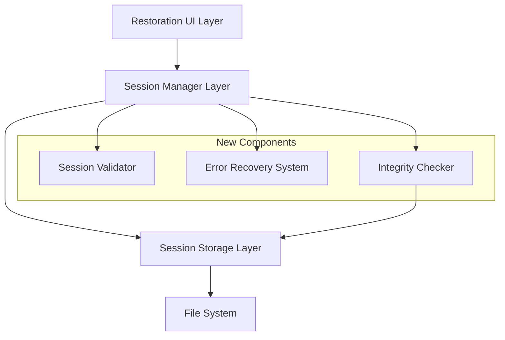

# Design Document

## Overview

The session restoration robustness feature addresses critical issues in the current session management system where missing session files cause infinite loops and poor user experience. The design implements comprehensive validation, error recovery, and user feedback mechanisms to ensure reliable session restoration.

The core problem occurs when the session index (`index.json`) contains references to sessions whose corresponding files have been deleted or corrupted. This creates a mismatch that causes the application to repeatedly attempt restoration of non-existent sessions, resulting in screen flickering and user frustration.

## Architecture

The solution follows a layered architecture with clear separation of concerns:



### Key Architectural Principles

1. **Fail-Safe Design**: The system defaults to safe operations when errors occur
2. **Progressive Recovery**: Multiple levels of recovery options from simple retry to complete bypass
3. **Transparent Operations**: All validation and cleanup operations are logged and reported to users
4. **Atomic Operations**: Index updates are atomic to prevent corruption during cleanup

## Components and Interfaces

### Session Validator

A new component responsible for validating session integrity and file existence:

```typescript
interface ISessionValidator {
  validateSessionFile(sessionId: SessionId): Promise<ValidationResult>;
  validateSessionIndex(): Promise<IndexValidationResult>;
  cleanupOrphanedEntries(): Promise<CleanupResult>;
  createIndexBackup(): Promise<string>;
}

interface ValidationResult {
  isValid: boolean;
  fileExists: boolean;
  isReadable: boolean;
  hasValidStructure: boolean;
  errors: string[];
  warnings: string[];
}

interface IndexValidationResult {
  isValid: boolean;
  orphanedEntries: SessionId[];
  orphanedFiles: string[];
  corruptedEntries: SessionId[];
  totalSessions: number;
  validSessions: number;
}
```

### Error Recovery System

Manages progressive error recovery with multiple fallback strategies:

```typescript
interface IErrorRecoverySystem {
  recordFailure(sessionId: SessionId, error: Error): void;
  isSessionProblematic(sessionId: SessionId): boolean;
  getRecoveryOptions(context: RecoveryContext): RecoveryOption[];
  shouldSkipSession(sessionId: SessionId): boolean;
  resetFailureTracking(): void;
}

interface RecoveryContext {
  failedSessionId: SessionId;
  attemptCount: number;
  totalFailures: number;
  availableSessions: SessionMetadata[];
  lastError: Error;
}

interface RecoveryOption {
  type: 'retry' | 'skip' | 'new-session' | 'select-different';
  label: string;
  description: string;
  action: () => Promise<void>;
  isRecommended: boolean;
}
```

### Enhanced Session Manager

The existing SessionManager is extended with validation and recovery capabilities:

```typescript
interface IEnhancedSessionManager extends ISessionManager {
  // New validation methods
  validateAllSessions(): Promise<ValidationSummary>;
  performIntegrityCheck(): Promise<IntegrityCheckResult>;
  cleanupInvalidSessions(): Promise<CleanupSummary>;
  
  // Enhanced restoration methods
  restoreSessionSafely(sessionId: SessionId): Promise<SafeRestorationResult>;
  detectAvailableSessionsSafely(options: DetectionOptions): Promise<SafeDetectionResult>;
}

interface SafeRestorationResult {
  success: boolean;
  session?: Session;
  error?: Error;
  recoveryOptions?: RecoveryOption[];
  contextFilesStatus?: {
    found: string[];
    missing: string[];
  };
}

interface SafeDetectionResult {
  validSessions: SessionMetadata[];
  invalidSessions: SessionId[];
  cleanupPerformed: boolean;
  warnings: string[];
}
```

### Enhanced Restoration UI

The UI components are enhanced to provide better error feedback and recovery options:

```typescript
interface IEnhancedRestorationUI {
  showValidationSummary(summary: ValidationSummary): void;
  showRecoveryOptions(options: RecoveryOption[]): Promise<RecoveryOption>;
  showCleanupProgress(progress: CleanupProgress): void;
  showErrorWithRecovery(error: Error, options: RecoveryOption[]): Promise<RecoveryOption>;
}
```

## Data Models

### Session Validation State

```typescript
interface SessionValidationState {
  sessionId: SessionId;
  status: 'valid' | 'missing-file' | 'corrupted' | 'unreadable';
  lastValidated: number;
  validationErrors: string[];
  fileSize?: number;
  lastModified?: number;
}
```

### Failure Tracking

```typescript
interface SessionFailureRecord {
  sessionId: SessionId;
  failures: FailureAttempt[];
  isBlacklisted: boolean;
  blacklistedUntil?: number;
  totalFailures: number;
  lastFailure: number;
}

interface FailureAttempt {
  timestamp: number;
  error: string;
  errorType: 'file-not-found' | 'corrupted' | 'permission-denied' | 'unknown';
  recoveryAttempted: boolean;
}
```

### Cleanup Operations

```typescript
interface CleanupOperation {
  type: 'remove-orphaned-index' | 'remove-orphaned-file' | 'repair-index' | 'create-backup';
  sessionId?: SessionId;
  filePath?: string;
  timestamp: number;
  success: boolean;
  error?: string;
}
```

## Correctness Properties

*A property is a characteristic or behavior that should hold true across all valid executions of a system-essentially, a formal statement about what the system should do. Properties serve as the bridge between human-readable specifications and machine-verifiable correctness guarantees.*

### Property 1: Session File Validation Consistency
*For any* session listed in the available sessions, the corresponding session file must exist and be readable on the file system.
**Validates: Requirements 1.1**

### Property 2: Index Cleanup Atomicity
*For any* session file that is missing, the corresponding entry must be removed from the session index, and the updated index must be persisted to disk.
**Validates: Requirements 1.2, 5.1, 5.4**

### Property 3: Validation Logging Completeness
*For any* missing session file detected during validation, a warning message must be logged with the session ID and file path.
**Validates: Requirements 1.3, 5.3**

### Property 4: Restoration Failure Recovery
*For any* session restoration that fails due to a missing file, the system must provide recovery options and not automatically retry the same session.
**Validates: Requirements 2.1, 2.2, 2.3**

### Property 5: Progressive Recovery Escalation
*For any* sequence of multiple restoration failures, the system must eventually offer the option to skip session restoration entirely.
**Validates: Requirements 2.4**

### Property 6: Startup Integrity Check
*For any* system startup, an integrity check must be performed on the session index before presenting sessions to the user.
**Validates: Requirements 3.1**

### Property 7: Orphaned Entry Cleanup
*For any* orphaned index entry (entry without corresponding file), the entry must be removed from the index during integrity checks.
**Validates: Requirements 3.2, 5.1**

### Property 8: Orphaned File Handling
*For any* orphaned session file (file without index entry), the system must either recreate the index entry or remove the file.
**Validates: Requirements 3.3**

### Property 9: Index Backup Creation
*For any* integrity correction operation, a backup of the original index must be created before modifications are made.
**Validates: Requirements 3.4**

### Property 10: User Feedback Completeness
*For any* validation or cleanup operation, the user must be informed about the problems found and actions taken.
**Validates: Requirements 4.1, 4.4**

### Property 11: Recovery Option Clarity
*For any* recovery options presented to the user, each option must include a clear description of its consequences.
**Validates: Requirements 4.2**

### Property 12: New Session Bypass Availability
*For any* session restoration scenario, a "Continue with New Session" option must be available that bypasses all restoration attempts.
**Validates: Requirements 4.3**

### Property 13: Valid Session Preservation
*For any* cleanup operation, all valid sessions and their metadata must be preserved unchanged.
**Validates: Requirements 5.2**

### Property 14: Failure Tracking Persistence
*For any* session restoration failure, the failure must be recorded and the session must be excluded from future automatic restoration attempts.
**Validates: Requirements 6.1, 6.2**

### Property 15: Retry Limit Enforcement
*For any* session restoration operation, the number of retry attempts must not exceed the configured maximum limit.
**Validates: Requirements 6.3**

### Property 16: Fallback Session Creation
*For any* scenario where the retry limit is exceeded, the system must fall back to creating a new session.
**Validates: Requirements 6.4**

## Error Handling

### Error Classification

The system classifies errors into categories for appropriate handling:

1. **Recoverable Errors**: Missing files, permission issues, temporary I/O errors
2. **Corruption Errors**: Invalid JSON, schema validation failures
3. **System Errors**: Disk full, network issues (for remote storage)
4. **User Errors**: Invalid session selections, cancelled operations

### Error Recovery Strategies

1. **Immediate Recovery**: Retry with exponential backoff for temporary errors
2. **Alternative Selection**: Offer different session when current fails
3. **Graceful Degradation**: Continue with limited functionality
4. **Complete Bypass**: Skip session restoration entirely

### Error Reporting

All errors are logged with structured information:
- Error type and severity
- Session ID and file paths involved
- Recovery actions attempted
- User decisions made
- System state before and after error

## TypeScript Implementation Guidelines

### Type Safety Best Practices

To prevent common TypeScript errors and ensure robust implementation:

#### 1. Strict Type Definitions

**DO**: Use strict type definitions with proper null handling
```typescript
interface SessionValidationResult {
  isValid: boolean;
  errors: string[];
  warnings: string[];
  sessionId: SessionId;
  filePath: string | null; // Explicit null handling
}

// Use discriminated unions for different states
type ValidationState = 
  | { status: 'valid'; session: Session }
  | { status: 'missing'; sessionId: SessionId; error: string }
  | { status: 'corrupted'; sessionId: SessionId; error: string };
```

**DON'T**: Use `any` types or implicit undefined
```typescript
// Avoid this
interface BadValidationResult {
  isValid: any; // Too loose
  errors?: string[]; // Implicit undefined can cause runtime errors
  session; // Missing type annotation
}
```

#### 2. Error Handling Patterns

**DO**: Use Result/Either patterns for error handling
```typescript
type Result<T, E = Error> = 
  | { success: true; data: T }
  | { success: false; error: E };

async function validateSession(sessionId: SessionId): Promise<Result<Session, ValidationError>> {
  try {
    const session = await loadSession(sessionId);
    return { success: true, data: session };
  } catch (error) {
    return { 
      success: false, 
      error: new ValidationError(`Failed to validate session: ${error.message}`) 
    };
  }
}
```

**DON'T**: Throw exceptions without proper typing
```typescript
// Avoid this - unclear what errors can be thrown
async function badValidateSession(sessionId: SessionId): Promise<Session> {
  // Could throw any type of error
  return await loadSession(sessionId);
}
```

#### 3. Async/Await Best Practices

**DO**: Properly handle Promise rejections and use typed errors
```typescript
async function safeSessionOperation(sessionId: SessionId): Promise<Result<void, SessionError>> {
  try {
    await this.storage.writeSession(sessionId, session);
    await this.updateIndex(sessionId);
    return { success: true, data: undefined };
  } catch (error) {
    const sessionError = error instanceof SessionError 
      ? error 
      : new SessionError(`Unexpected error: ${error.message}`);
    return { success: false, error: sessionError };
  }
}
```

**DON'T**: Use untyped catch blocks or ignore Promise rejections
```typescript
// Avoid this
async function badSessionOperation(sessionId: SessionId): Promise<void> {
  try {
    await this.storage.writeSession(sessionId, session);
    this.updateIndex(sessionId); // Missing await - potential race condition
  } catch (e) { // Untyped error
    console.log(e); // Poor error handling
  }
}
```

#### 4. Interface Segregation

**DO**: Create focused, single-responsibility interfaces
```typescript
interface ISessionFileValidator {
  validateFileExists(sessionId: SessionId): Promise<boolean>;
  validateFileReadable(sessionId: SessionId): Promise<boolean>;
  validateFileStructure(sessionId: SessionId): Promise<ValidationResult>;
}

interface ISessionIndexManager {
  updateIndex(metadata: SessionMetadata): Promise<void>;
  removeFromIndex(sessionId: SessionId): Promise<void>;
  createIndexBackup(): Promise<string>;
}
```

**DON'T**: Create monolithic interfaces with mixed responsibilities
```typescript
// Avoid this - too many responsibilities
interface IBadSessionManager {
  validateFile(sessionId: SessionId): Promise<boolean>;
  updateUI(message: string): void;
  logError(error: Error): void;
  sendNetworkRequest(url: string): Promise<any>;
  parseJSON(data: string): any;
}
```

#### 5. Generic Type Constraints

**DO**: Use proper generic constraints and defaults
```typescript
interface IRecoveryStrategy<TError extends Error = Error, TResult = void> {
  canHandle(error: TError): boolean;
  recover(error: TError): Promise<Result<TResult, TError>>;
}

class FileNotFoundRecovery implements IRecoveryStrategy<FileNotFoundError, Session> {
  canHandle(error: Error): error is FileNotFoundError {
    return error instanceof FileNotFoundError;
  }
  
  async recover(error: FileNotFoundError): Promise<Result<Session, FileNotFoundError>> {
    // Implementation
  }
}
```

**DON'T**: Use unconstrained generics or poor type guards
```typescript
// Avoid this
interface IBadRecoveryStrategy<T, U> { // Unconstrained generics
  canHandle(error: any): boolean; // Poor type checking
  recover(error: T): U; // No Promise wrapper, unclear error handling
}
```

#### 6. Null Safety and Optional Chaining

**DO**: Use optional chaining and nullish coalescing appropriately
```typescript
function getSessionTitle(session: Session | null): string {
  return session?.title ?? 'Untitled Session';
}

function processSessionMetadata(metadata: SessionMetadata | undefined): ProcessedMetadata {
  if (!metadata) {
    throw new Error('Session metadata is required');
  }
  
  return {
    id: metadata.id,
    title: metadata.title ?? 'Untitled',
    tags: metadata.tags ?? [],
    created: metadata.created,
  };
}
```

**DON'T**: Use unsafe property access or unclear null handling
```typescript
// Avoid this
function badGetSessionTitle(session: any): string {
  return session.title || 'Untitled'; // Unsafe - could be undefined.title
}

function badProcessMetadata(metadata: any) {
  // No null checking, unclear return type
  return {
    id: metadata.id,
    title: metadata.title,
    tags: metadata.tags,
  };
}
```

### Common Error Prevention Patterns

1. **Always use explicit return types** for public methods
2. **Validate inputs** at function boundaries with proper error messages
3. **Use readonly arrays and objects** where mutation isn't intended
4. **Implement proper error hierarchies** with specific error types
5. **Use branded types** for IDs to prevent mixing different ID types
6. **Leverage TypeScript's strict mode** settings in tsconfig.json

### Recommended tsconfig.json Settings

```json
{
  "compilerOptions": {
    "strict": true,
    "noImplicitAny": true,
    "noImplicitReturns": true,
    "noImplicitThis": true,
    "noUnusedLocals": true,
    "noUnusedParameters": true,
    "exactOptionalPropertyTypes": true,
    "noUncheckedIndexedAccess": true
  }
}
```

## Testing Strategy

### Unit Testing Approach

Unit tests focus on individual components and their specific behaviors:

- **Session Validator**: Test file existence checking, validation logic, error detection
- **Error Recovery System**: Test failure tracking, recovery option generation, blacklisting
- **Enhanced Session Manager**: Test integration between validation and existing functionality
- **UI Components**: Test error display, user interaction, option selection

### Property-Based Testing Configuration

Property-based tests validate universal behaviors across all inputs:

- **Minimum 100 iterations** per property test due to randomization
- **Test data generators** for sessions, file systems, error conditions
- **Invariant checking** for data consistency during operations
- **State-based testing** for multi-step operations like cleanup

Each property test references its design document property:
- **Tag format**: `Feature: session-restoration-robustness, Property {number}: {property_text}`

### Integration Testing

Integration tests verify end-to-end scenarios:

- **Missing file scenarios**: Create sessions with missing files, verify cleanup
- **Corruption scenarios**: Create corrupted session files, verify error handling
- **Recovery workflows**: Test complete user recovery journeys
- **Startup scenarios**: Test various system states during startup

### Test Data Management

- **Isolated test environments**: Each test uses separate session directories
- **Controlled file system states**: Tests create specific missing/corrupted file scenarios
- **Deterministic error injection**: Predictable error conditions for consistent testing
- **Cleanup verification**: Tests verify proper cleanup of test artifacts