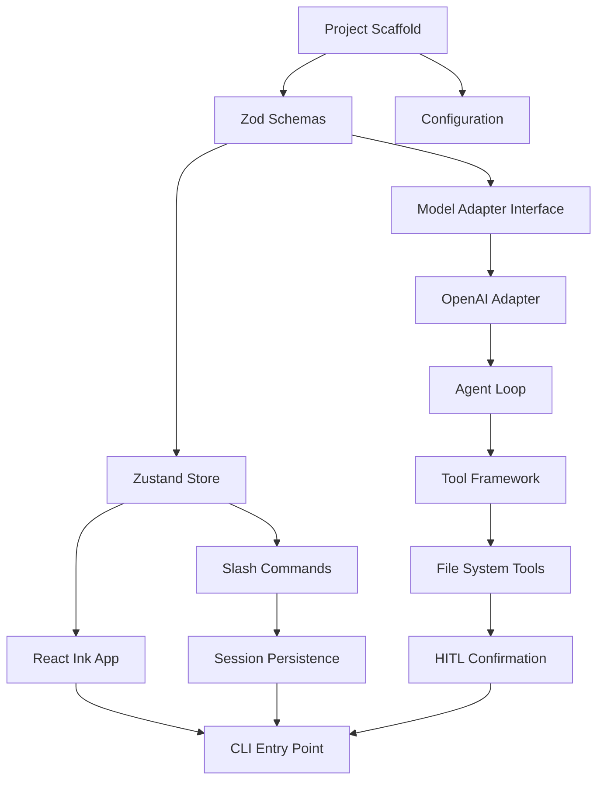

# Phase 1 Implementation Plan: Foundation

**Timeline:** Months 1-3  
**Goal:** Core CLI with single model support, basic tools, and session persistence  
**Target:** Developer can have multi-turn conversations about codebase with file operations and session management

---

## 1. Project Scaffold (Week 1-2)

### 1.1 Initialize Project Structure

```
theo-code/
├── src/
│   ├── features/                    # Vertical slice architecture
│   │   ├── chat/                    # Chat/conversation feature
│   │   │   ├── __tests__/
│   │   │   ├── components/          # React Ink chat components
│   │   │   ├── hooks/               # Chat-specific hooks
│   │   │   ├── schemas/             # Zod schemas for messages
│   │   │   ├── types/               # TypeScript types
│   │   │   └── index.ts
│   │   ├── commands/                # Slash command system
│   │   │   ├── __tests__/
│   │   │   ├── handlers/            # Individual command handlers
│   │   │   ├── schemas/
│   │   │   └── index.ts
│   │   ├── tools/                   # Native tool implementations
│   │   │   ├── __tests__/
│   │   │   ├── filesystem/          # read_file, write_file, list_files
│   │   │   ├── search/              # grep_search
│   │   │   ├── schemas/
│   │   │   └── index.ts
│   │   ├── session/                 # Session persistence
│   │   │   ├── __tests__/
│   │   │   ├── services/
│   │   │   ├── schemas/
│   │   │   └── index.ts
│   │   └── model/                   # LLM integration (OpenAI first)
│   │       ├── __tests__/
│   │       ├── adapters/            # Model adapters (UMAL foundation)
│   │       ├── schemas/
│   │       └── index.ts
│   ├── shared/
│   │   ├── components/              # Shared React Ink components
│   │   │   ├── Input/
│   │   │   ├── Spinner/
│   │   │   ├── DiffView/
│   │   │   ├── ConfirmDialog/
│   │   │   └── index.ts
│   │   ├── hooks/                   # Shared custom hooks
│   │   │   ├── useKeyboard.ts
│   │   │   ├── useConfig.ts
│   │   │   └── index.ts
│   │   ├── utils/                   # Helper functions
│   │   │   ├── tokenizer.ts
│   │   │   ├── logger.ts
│   │   │   ├── paths.ts
│   │   │   └── index.ts
│   │   ├── types/                   # Shared TypeScript types
│   │   │   ├── models.ts
│   │   │   ├── tools.ts
│   │   │   └── index.ts
│   │   └── constants/
│   │       └── index.ts
│   ├── config/                      # Configuration management
│   │   ├── schemas/
│   │   ├── loader.ts
│   │   └── index.ts
│   ├── app.tsx                      # Main React Ink app
│   └── cli.ts                       # CLI entry point (Commander.js)
├── test/
│   ├── setup.ts                     # Vitest setup
│   ├── fixtures/                    # Test fixtures
│   └── mocks/                       # Shared mocks
├── .agent-policy.yaml               # Default security policy
├── package.json
├── tsconfig.json
├── tsconfig.app.json
├── tsconfig.node.json
├── vitest.config.ts
├── eslint.config.js
├── prettier.config.js
└── README.md
```

### 1.2 Dependencies to Install

```json
{
  "dependencies": {
    "ink": "^4.4.1",
    "ink-text-input": "^5.0.1",
    "ink-spinner": "^5.0.0",
    "ink-syntax-highlight": "^1.0.0",
    "react": "^19.0.0",
    "openai": "^4.70.0",
    "zod": "^3.23.0",
    "zustand": "^5.0.0",
    "commander": "^12.1.0",
    "tiktoken": "^1.0.0",
    "keytar": "^7.9.0",
    "yaml": "^2.4.0",
    "glob": "^11.0.0",
    "chalk": "^5.3.0",
    "diff": "^7.0.0"
  },
  "devDependencies": {
    "typescript": "^5.6.0",
    "vitest": "^2.1.0",
    "@testing-library/react": "^16.0.0",
    "ink-testing-library": "^4.0.0",
    "@types/node": "^22.0.0",
    "@types/react": "^19.0.0",
    "@types/diff": "^7.0.0",
    "eslint": "^9.15.0",
    "@typescript-eslint/eslint-plugin": "^8.0.0",
    "@typescript-eslint/parser": "^8.0.0",
    "eslint-plugin-react": "^7.37.0",
    "eslint-plugin-react-hooks": "^5.0.0",
    "eslint-plugin-sonarjs": "^3.0.0",
    "prettier": "^3.4.0",
    "@vitest/coverage-v8": "^2.1.0",
    "tsx": "^4.19.0"
  }
}
```

### 1.3 Configuration Files

**Tasks:**
- [ ] Create `tsconfig.json` with strict mode settings per CLAUDE.md
- [ ] Create `tsconfig.app.json` for src/ directory
- [ ] Create `tsconfig.node.json` for config files (vite, vitest, eslint)
- [ ] Create `eslint.config.js` with TypeScript, React, SonarJS rules
- [ ] Create `prettier.config.js` with consistent formatting
- [ ] Create `vitest.config.ts` with coverage thresholds (80%)
- [ ] Create `.gitignore` for Node.js/TypeScript project

---

## 2. Core Infrastructure (Week 2-3)

### 2.1 Zod Schemas (Foundation)

**File:** `src/shared/types/schemas.ts`

```typescript
// Branded types for type safety
const MessageIdSchema = z.string().uuid().brand<'MessageId'>();
const SessionIdSchema = z.string().uuid().brand<'SessionId'>();
const FilePathSchema = z.string().min(1).brand<'FilePath'>();

// Core message schema
const MessageSchema = z.object({
  id: MessageIdSchema,
  role: z.enum(['user', 'assistant', 'system', 'tool']),
  content: z.union([z.string(), z.array(ContentBlockSchema)]),
  timestamp: z.number(),
  model: z.string().optional(),
  tokens: z.object({
    input: z.number(),
    output: z.number(),
  }).optional(),
  toolCalls: z.array(ToolCallSchema).optional(),
  toolResults: z.array(ToolResultSchema).optional(),
});

// Session schema
const SessionSchema = z.object({
  id: SessionIdSchema,
  created: z.number(),
  lastModified: z.number(),
  model: z.string(),
  tokenCount: z.object({
    total: z.number(),
    input: z.number(),
    output: z.number(),
  }),
  filesAccessed: z.array(z.string()),
  messages: z.array(MessageSchema),
  contextFiles: z.array(z.string()),
});

// Tool definition schema (universal format)
const ToolDefinitionSchema = z.object({
  name: z.string(),
  description: z.string(),
  parameters: z.object({
    type: z.literal('object'),
    properties: z.record(ParameterSchemaSchema),
    required: z.array(z.string()),
  }),
});
```

**Tasks:**
- [ ] Define all branded ID types (MessageId, SessionId, ToolCallId)
- [ ] Define ContentBlock schema (text, image, tool_use, tool_result)
- [ ] Define ToolCall and ToolResult schemas
- [ ] Define Configuration schemas (global config, project config)
- [ ] Export inferred TypeScript types from all schemas

### 2.2 State Management (Zustand)

**File:** `src/shared/store/index.ts`

```typescript
interface AppState {
  // Session state
  session: Session | null;
  messages: Message[];
  
  // UI state
  isStreaming: boolean;
  pendingToolCalls: ToolCall[];
  
  // Context state
  contextFiles: Map<string, string>;
  workspaceRoot: string;
  
  // Actions
  addMessage: (message: Message) => void;
  updateMessage: (id: MessageId, updates: Partial<Message>) => void;
  setStreaming: (streaming: boolean) => void;
  addContextFile: (path: string, content: string) => void;
  removeContextFile: (path: string) => void;
  clearSession: () => void;
}
```

**Tasks:**
- [ ] Create Zustand store with typed state and actions
- [ ] Implement message management actions
- [ ] Implement context file management
- [ ] Implement session state management
- [ ] Add middleware for session auto-save (every 30 seconds)

### 2.3 Configuration Management

**File:** `src/config/loader.ts`

**Configuration Locations:**
1. `~/.theo-code/config.yaml` - Global settings
2. `.agentrc` - Project-specific settings
3. `AGENTS.md` - Project instructions (auto-loaded)
4. `.agent-policy.yaml` - Security policies

**Tasks:**
- [ ] Define configuration schemas with Zod
- [ ] Implement config file discovery (global → project → env vars)
- [ ] Implement config merging (project overrides global)
- [ ] Implement AGENTS.md parser (inject as system prompt)
- [ ] Implement secure API key retrieval (keytar integration)

---

## 3. React Ink TUI (Week 3-4)

### 3.1 Application Shell

**File:** `src/app.tsx`

```
┌─────────────────────────────────────────────────────┐
│  theo-code v0.1.0 | Model: gpt-4o | Tokens: 1,234   │  ← Header
├─────────────────────────────────────────────────────┤
│                                                     │
│  User: Explain the authentication module            │  ← Message List
│                                                     │
│  Assistant: The authentication module...            │
│  [streaming...]                                     │
│                                                     │
├─────────────────────────────────────────────────────┤
│  > Type your message... (Tab: commands, Ctrl+C: exit)│  ← Input
└─────────────────────────────────────────────────────┘
```

**Tasks:**
- [ ] Create `App` component with Flexbox layout
- [ ] Create `Header` component (model, tokens, session status)
- [ ] Create `MessageList` component with auto-scroll
- [ ] Create `MessageBubble` component (user/assistant/tool variants)
- [ ] Create `Input` component with history navigation
- [ ] Create `StreamingText` component for token-by-token display

### 3.2 Shared Components

**Components to implement:**

| Component | Purpose | Priority |
|-----------|---------|----------|
| `Spinner` | Loading states | P0 |
| `ConfirmDialog` | User confirmations (Y/n) | P0 |
| `DiffView` | File change visualization | P0 |
| `CodeBlock` | Syntax-highlighted code | P0 |
| `FileTree` | Directory visualization | P1 |
| `ProgressBar` | Long operation progress | P1 |
| `ErrorBoundary` | Error handling wrapper | P0 |

**Tasks:**
- [ ] Implement `Spinner` with customizable text
- [ ] Implement `ConfirmDialog` with keyboard handlers
- [ ] Implement `DiffView` using diff library (red/green highlighting)
- [ ] Implement `CodeBlock` with language detection
- [ ] Implement `ErrorBoundary` with fallback UI
- [ ] Write tests for each component (ink-testing-library)

### 3.3 Keyboard Handling

**File:** `src/shared/hooks/useKeyboard.ts`

**Key Bindings:**
- `Enter` - Submit message
- `Ctrl+C` - Exit (with confirmation)
- `Ctrl+L` - Clear screen
- `Up/Down` - History navigation
- `Tab` - Command autocomplete
- `Escape` - Cancel current operation

**Tasks:**
- [ ] Create `useKeyboard` hook with Ink's `useInput`
- [ ] Implement command history navigation
- [ ] Implement slash command tab completion
- [ ] Handle graceful exit with session save

---

## 4. OpenAI Integration (Week 4-5)

### 4.1 Model Adapter Interface (UMAL Foundation)

**File:** `src/features/model/adapters/types.ts`

```typescript
interface IModelAdapter {
  /** Provider name for display */
  readonly provider: string;
  
  /** Model identifier */
  readonly model: string;
  
  /** Maximum context window in tokens */
  readonly contextLimit: number;
  
  /** Whether model supports native tool calling */
  readonly supportsToolCalling: boolean;
  
  /** Convert universal tool definitions to provider format */
  adaptTools(tools: UniversalToolDefinition[]): ProviderToolFormat;
  
  /** Generate streaming response */
  generateStream(
    messages: Message[],
    tools?: UniversalToolDefinition[],
    options?: GenerateOptions
  ): AsyncGenerator<StreamChunk>;
  
  /** Count tokens for messages */
  countTokens(messages: Message[]): number;
}
```

**Tasks:**
- [ ] Define `IModelAdapter` interface
- [ ] Define `StreamChunk` union type (text, tool_call, done, error)
- [ ] Define `GenerateOptions` (temperature, maxTokens, etc.)
- [ ] Create adapter factory function

### 4.2 OpenAI Adapter Implementation

**File:** `src/features/model/adapters/openai.ts`

**Tasks:**
- [ ] Implement `OpenAIAdapter` class
- [ ] Implement `adaptTools()` - convert to OpenAI function format
- [ ] Implement `generateStream()` - use streaming API
- [ ] Implement `countTokens()` - use tiktoken
- [ ] Handle API errors (rate limit, auth, validation)
- [ ] Implement retry logic with exponential backoff
- [ ] Write comprehensive tests with mocked OpenAI client

### 4.3 Agent Loop

**File:** `src/features/chat/services/agentLoop.ts`

```typescript
async function* runAgentLoop(
  userMessage: string,
  adapter: IModelAdapter,
  tools: UniversalToolDefinition[],
  state: AppState
): AsyncGenerator<AgentEvent> {
  // 1. Build messages array with system prompt + history
  // 2. Call adapter.generateStream()
  // 3. Yield text chunks for streaming display
  // 4. If tool_call received:
  //    a. Yield tool_call event for UI
  //    b. Execute tool (with confirmation if needed)
  //    c. Yield tool_result event
  //    d. Continue loop with tool result
  // 5. Yield done event when complete
}
```

**Tasks:**
- [ ] Implement agent loop generator function
- [ ] Handle text streaming (yield chunks immediately)
- [ ] Handle tool calls (pause for execution)
- [ ] Implement tool result injection back into conversation
- [ ] Handle multi-turn tool calling (loop until no more tool calls)
- [ ] Implement token counting and limit warnings
- [ ] Write tests for various conversation flows

---

## 5. Native Tools (Week 5-6)

### 5.1 Tool Framework

**File:** `src/features/tools/framework.ts`

```typescript
interface Tool<TInput, TOutput> {
  definition: UniversalToolDefinition;
  inputSchema: z.ZodType<TInput>;
  outputSchema: z.ZodType<TOutput>;
  requiresConfirmation: boolean;
  execute(input: TInput, context: ToolContext): Promise<TOutput>;
}

interface ToolContext {
  workspaceRoot: string;
  confirm: (message: string) => Promise<boolean>;
  onProgress?: (message: string) => void;
}
```

**Tasks:**
- [ ] Define `Tool` interface with generic input/output
- [ ] Define `ToolContext` for execution environment
- [ ] Create tool registry for dynamic tool lookup
- [ ] Implement tool executor with confirmation flow

### 5.2 File System Tools

**Tool: `read_file`**
```typescript
{
  name: 'read_file',
  description: 'Read contents of a file',
  parameters: {
    path: { type: 'string', description: 'File path relative to workspace' },
    line_start: { type: 'number', description: 'Starting line (1-indexed)', optional: true },
    line_end: { type: 'number', description: 'Ending line (inclusive)', optional: true }
  }
}
```

**Tool: `write_file`**
```typescript
{
  name: 'write_file',
  description: 'Write content to a file (requires confirmation)',
  parameters: {
    path: { type: 'string', description: 'File path relative to workspace' },
    content: { type: 'string', description: 'Content to write' }
  },
  requiresConfirmation: true
}
```

**Tool: `list_files`**
```typescript
{
  name: 'list_files',
  description: 'List files in a directory',
  parameters: {
    path: { type: 'string', description: 'Directory path' },
    recursive: { type: 'boolean', description: 'Include subdirectories' },
    pattern: { type: 'string', description: 'Glob pattern filter', optional: true }
  }
}
```

**Tool: `grep_search`**
```typescript
{
  name: 'grep_search',
  description: 'Search for pattern in files',
  parameters: {
    path: { type: 'string', description: 'Directory to search' },
    pattern: { type: 'string', description: 'Regex pattern' },
    file_pattern: { type: 'string', description: 'File glob filter', optional: true }
  }
}
```

**Tasks:**
- [ ] Implement `read_file` with line range support
- [ ] Implement `write_file` with diff preview and confirmation
- [ ] Implement `list_files` with glob pattern support
- [ ] Implement `grep_search` using ripgrep or native regex
- [ ] Implement `create_directory` tool
- [ ] Add path validation (prevent traversal outside workspace)
- [ ] Write tests for all file operations

### 5.3 Human-in-the-Loop (HITL)

**File:** `src/features/tools/confirmation.ts`

**Tasks:**
- [ ] Create `ConfirmationService` for managing approvals
- [ ] Implement diff generation for file writes
- [ ] Integrate with `DiffView` component
- [ ] Track approved operations in audit log
- [ ] Support "approve all similar" option for batch operations

---

## 6. Slash Commands (Week 6-7)

### 6.1 Command Parser

**File:** `src/features/commands/parser.ts`

```typescript
interface ParsedCommand {
  name: string;
  args: string[];
  flags: Record<string, string | boolean>;
  raw: string;
}

function parseCommand(input: string): ParsedCommand | null {
  // Returns null if not a command (doesn't start with /)
  // Parses: /add @src/file.ts --recursive
}
```

**Tasks:**
- [ ] Implement command parser with argument extraction
- [ ] Support `@` prefix for file/directory references
- [ ] Support `--flag` and `--flag=value` syntax
- [ ] Return null for non-commands (regular messages)

### 6.2 Phase 1 Commands

| Command | Description | Implementation |
|---------|-------------|----------------|
| `/help [command]` | Show help text | Display command list or specific help |
| `/new` | Start new session | Clear state, archive current session |
| `/add @path` | Add file/dir to context | Read and inject into context |
| `/drop @path` | Remove from context | Remove from context map |
| `/map [depth]` | Show directory tree | Generate ASCII tree |
| `/exit` | Exit CLI | Save session, graceful shutdown |

**Tasks:**
- [ ] Create `CommandHandler` interface
- [ ] Implement `/help` with dynamic command discovery
- [ ] Implement `/new` with session archival
- [ ] Implement `/add` with glob pattern support
- [ ] Implement `/drop` with confirmation
- [ ] Implement `/map` with configurable depth
- [ ] Implement `/exit` with session save
- [ ] Add tab completion for commands and file paths

### 6.3 Context Injection

**File:** `src/features/commands/handlers/add.ts`

**Tasks:**
- [ ] Parse file/directory path from command
- [ ] Read file contents (with size limits)
- [ ] For directories: recursively read or use glob
- [ ] Add to Zustand context store
- [ ] Update token count display
- [ ] Handle binary files (skip with warning)
- [ ] Respect `.gitignore` patterns

---

## 7. Session Persistence (Week 7-8)

### 7.1 Session Storage

**File:** `src/features/session/services/storage.ts`

**Storage Location:** `~/.theo-code/sessions/`

**File Format:**
```
sessions/
├── index.json           # Session index for quick listing
├── abc123.json          # Individual session files
├── def456.json
└── ...
```

**Tasks:**
- [ ] Implement session serialization (Zod validated)
- [ ] Implement session deserialization with migration support
- [ ] Implement session index for fast listing
- [ ] Implement auto-save middleware (30-second interval)
- [ ] Implement session cleanup (keep last 50)

### 7.2 Session Commands

**Tasks:**
- [ ] Implement session listing with preview
- [ ] Implement `/resume [id]` with interactive picker
- [ ] Implement session metadata display (tokens, duration, files)
- [ ] Implement session export as JSON

---

## 8. CLI Entry Point (Week 8)

### 8.1 Commander.js Setup

**File:** `src/cli.ts`

```bash
# Usage examples
theo-code                    # Start interactive mode
theo-code init              # First-time setup
theo-code --model gpt-4o    # Override model
theo-code --verbose         # Enable debug logging
theo-code --version         # Show version
```

**Tasks:**
- [ ] Set up Commander.js with subcommands
- [ ] Implement `init` command for first-time setup
- [ ] Implement model override via `--model` flag
- [ ] Implement `--verbose` logging mode
- [ ] Add shebang and make executable
- [ ] Configure package.json `bin` field

### 8.2 First-Time Setup

**File:** `src/features/setup/wizard.ts`

**Tasks:**
- [ ] Create interactive setup wizard
- [ ] Prompt for API key (store in keytar)
- [ ] Create default config file
- [ ] Display welcome message with tutorial

---

## 9. Testing Strategy (Ongoing)

### 9.1 Unit Tests

**Coverage Target:** 80%+ for all features

| Feature | Test Focus |
|---------|------------|
| Schemas | Validation, edge cases, error messages |
| Adapters | API translation, streaming, error handling |
| Tools | Input validation, execution, output format |
| Commands | Parsing, execution, state changes |
| Components | Rendering, keyboard interaction |
| Session | Serialization, migration, cleanup |

### 9.2 Integration Tests

**Tasks:**
- [ ] Test full conversation flow (user → agent → tool → response)
- [ ] Test session save/restore cycle
- [ ] Test command execution end-to-end
- [ ] Test error recovery scenarios

### 9.3 Test Fixtures

**Tasks:**
- [ ] Create mock OpenAI responses (streaming, tool calls)
- [ ] Create sample codebases for tool testing
- [ ] Create session fixtures for restore testing

---

## 10. Documentation (Week 8)

### 10.1 User Documentation

**Tasks:**
- [ ] Update README.md with installation and usage
- [ ] Create GETTING_STARTED.md tutorial
- [ ] Document all slash commands
- [ ] Create troubleshooting guide

### 10.2 Developer Documentation

**Tasks:**
- [ ] Document architecture decisions (ADRs)
- [ ] Create contribution guidelines
- [ ] Document tool development process
- [ ] Add JSDoc to all public APIs

---

## 11. Deliverables Checklist

### Week 1-2: Project Setup
- [ ] Project scaffolding complete
- [ ] All dependencies installed
- [ ] TypeScript/ESLint/Prettier configured
- [ ] CI/CD pipeline (GitHub Actions) configured
- [ ] Initial test infrastructure

### Week 3-4: TUI Foundation
- [ ] React Ink app shell rendering
- [ ] Message list with streaming support
- [ ] Input component with history
- [ ] Shared components (Spinner, ConfirmDialog, DiffView)
- [ ] Keyboard handling complete

### Week 5-6: LLM + Tools
- [ ] OpenAI adapter functional
- [ ] Agent loop handling multi-turn conversations
- [ ] All file system tools implemented
- [ ] HITL confirmation flow working
- [ ] Tool execution tested

### Week 7-8: Commands + Sessions
- [ ] All Phase 1 commands implemented
- [ ] Session persistence working
- [ ] CLI entry point complete
- [ ] First-time setup wizard
- [ ] Documentation complete

### Final Validation
- [ ] 80%+ test coverage achieved
- [ ] Zero TypeScript errors
- [ ] ESLint passing with 0 warnings
- [ ] Manual QA of core flows
- [ ] Performance benchmarks met (<200ms command processing)

---

## 12. Success Criteria

Phase 1 is complete when a developer can:

1. ✅ Install via `npm install -g theo-code`
2. ✅ Run `theo-code init` and configure API key
3. ✅ Start interactive session with `theo-code`
4. ✅ Add codebase context with `/add @src`
5. ✅ Have multi-turn conversation about their code
6. ✅ See agent read files to answer questions
7. ✅ Approve file writes with diff preview
8. ✅ Exit and resume session later with `/resume`
9. ✅ All above working reliably with 80%+ test coverage

---

## 13. Risk Mitigation

| Risk | Mitigation |
|------|------------|
| React Ink learning curve | Allocate extra time in Week 3; reference ink examples |
| OpenAI streaming complexity | Study OpenAI SDK docs; start with non-streaming MVP |
| Token counting accuracy | Use official tiktoken; validate against OpenAI usage API |
| Session migration issues | Design schema versioning from day 1 |
| Test coverage gaps | Require tests with each PR; block merges below threshold |

---

## 14. Dependencies Between Tasks



**Critical Path:** Scaffold → Schemas → Store → App Shell → Adapter → Agent Loop → Tools → Commands → Sessions → CLI

---

*Last Updated: December 3, 2025*
